# athena-shell — Feature Overview

A visual tour of the major surfaces. Screenshots are captured from the
app running under `MOCK_AUTH=1`, so the data is representative but
synthetic. To regenerate:

```sh
SCREENSHOT_TOUR=1 pnpm --filter @athena-shell/e2e run e2e tour.spec.ts
```

Output lands in `docs/screenshots/`.

---

## Workspace — file browser

The workspace is an S3-backed file browser scoped to the caller's IAM
role prefix. Folders and objects behave like a normal tree; drag-drop
uploads, rename, copy, and delete map straight to S3 operations.

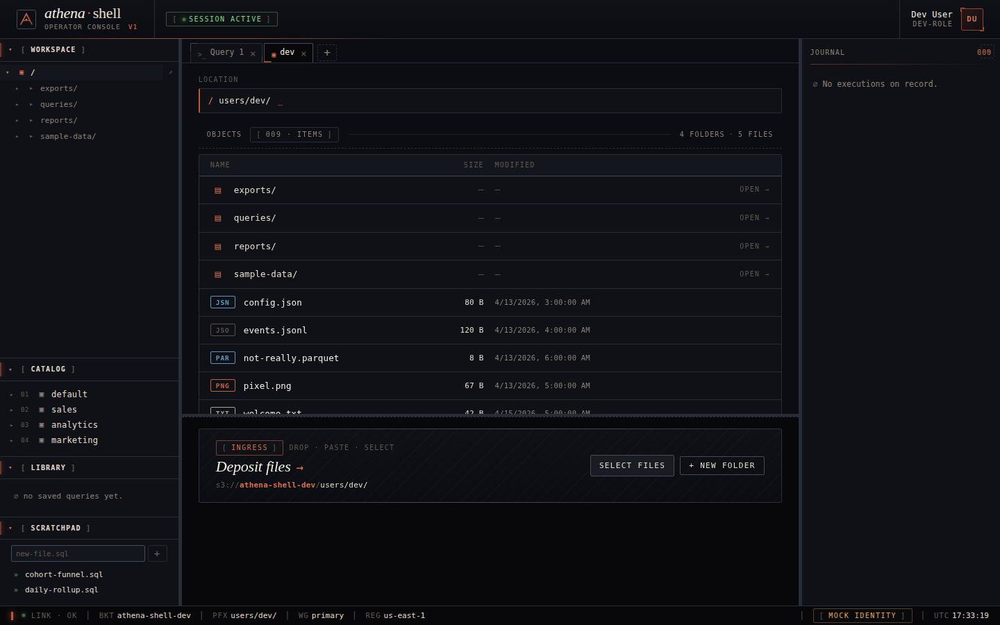

Drilling into a folder shows its objects with size and mtime. The
`[⊞]` affordance on CSV / Parquet rows launches the table-registration
flow without leaving the browser.

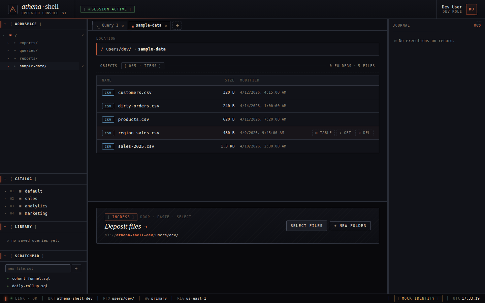

## File preview

Clicking an object opens a preview drawer. Format dispatch is
in-browser — CSV / JSONL render as virtualized tables, JSON as a tree,
Parquet is parsed with `hyparquet`, images render inline, and anything
else falls through to a raw-text view.

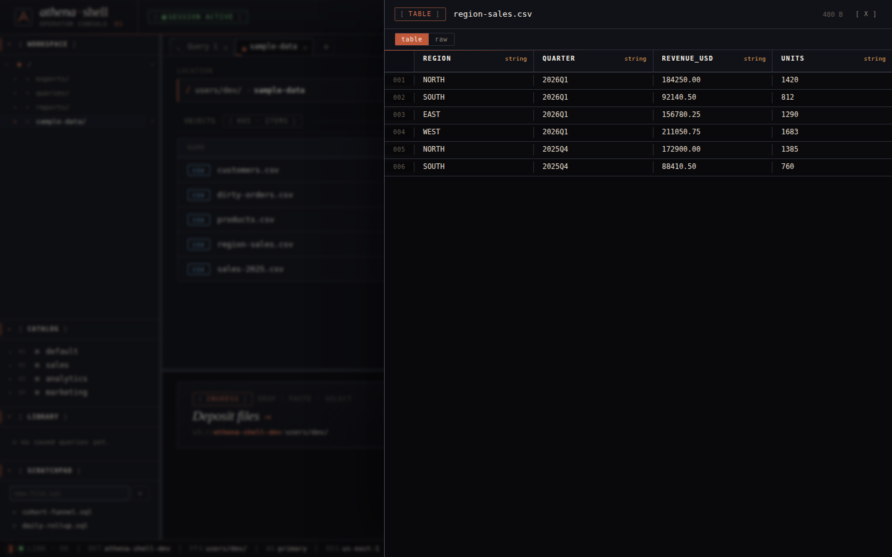

The preview also hosts a **raw** toggle, useful for seeing exactly what
Athena will consume when you point a table at this key.

## Register table

The CreateTable modal turns a CSV / Parquet object into an Athena
external table. Schema is inferred from a sampled head; risky columns
(ambiguous dates, values past `MAX_SAFE_INTEGER`) are auto-overridden
to `STRING` and surfaced in the findings panel. The file is moved into
a per-table subdirectory under `<prefix>/datasets/` so subsequent
partitions land alongside the original.

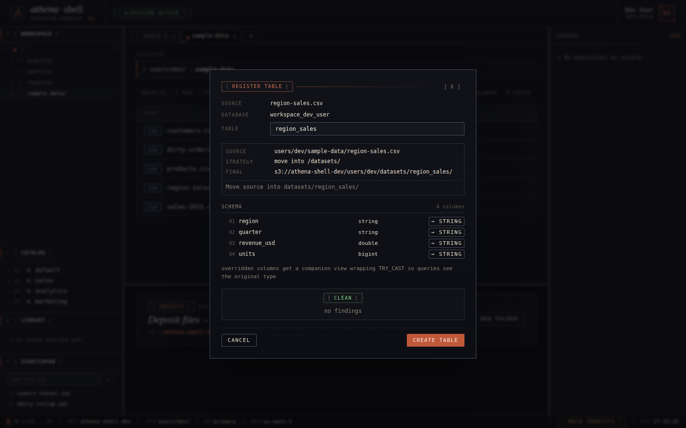

Advisory findings (type mismatches, null-token candidates, duplicate
table at the same location) gate the primary button until the user
either overrides or acknowledges each one.

## SQL editor + catalog

The query surface is a Monaco-backed SQL editor with a live catalog in
the side panel. Databases expand to tables; tables expand to columns
with types. Double-clicking (or the `▶` peek button) runs
`SELECT * FROM <table> LIMIT 10` into the active tab.

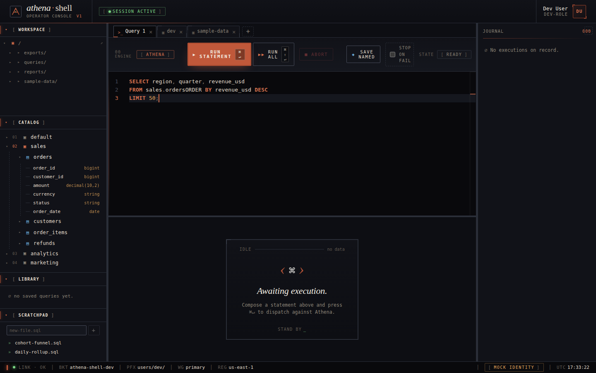

The toolbar splits **run statement** (⌘↵) from **run all** (⌘⇧↵) so
the current cursor statement and the full buffer are dispatched via
distinct shortcuts. Save buttons vary by tab kind: scratchpad tabs
get a write-back button; untitled drafts get **save named** to push
the query into the library.

## Query results

Results render into a virtualized table. Meta stats (rows, bytes
scanned, elapsed ms) sit above the table alongside the execution ID.
**Load more** pulls the full result set in a single S3-direct fetch,
bypassing Athena's `GetQueryResults` pagination. **CSV** exports the
visible page; **Save** pushes the full result back into the workspace
as a new S3 object with an optional `.sql` sidecar.

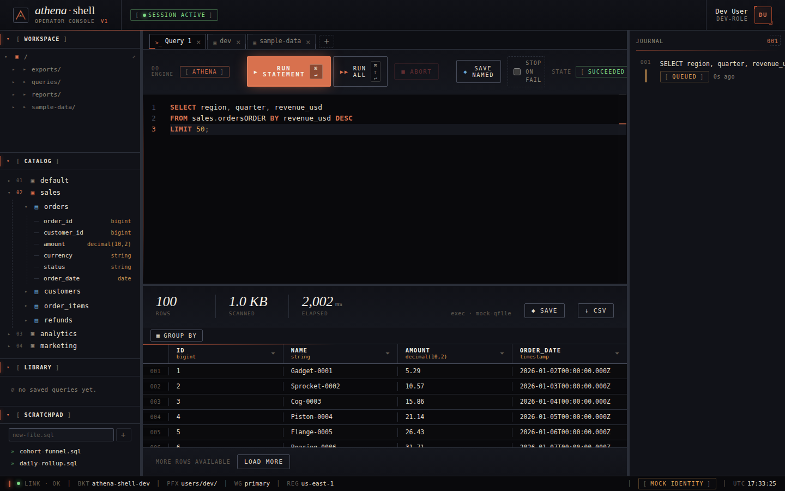

Column headers are filterable; a **Group by** bar rolls the current
result set into aggregations without leaving the page.

## Journal / history

Every execution is recorded in the right-hand journal panel — SQL,
state, elapsed, and a click-to-rehydrate handle that restores the
result set and editor buffer of a prior run.

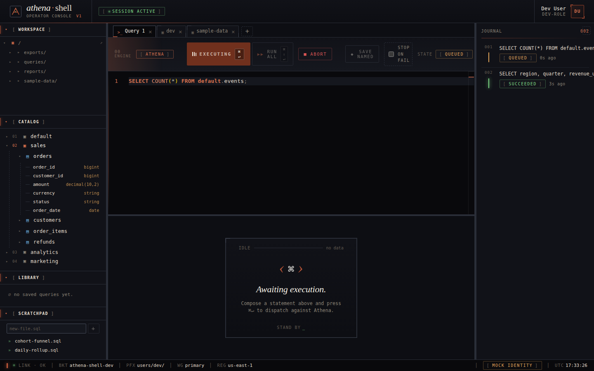

History is scoped to the session's mock store in dev mode; in
production it comes from the proxy-backed history repo.

## Saved queries

The **library** section stores named queries. Names are immutable
once saved (so a bookmark / Slack share can't silently point at
changed SQL) — edits create a new entry. Deletes require a confirm.

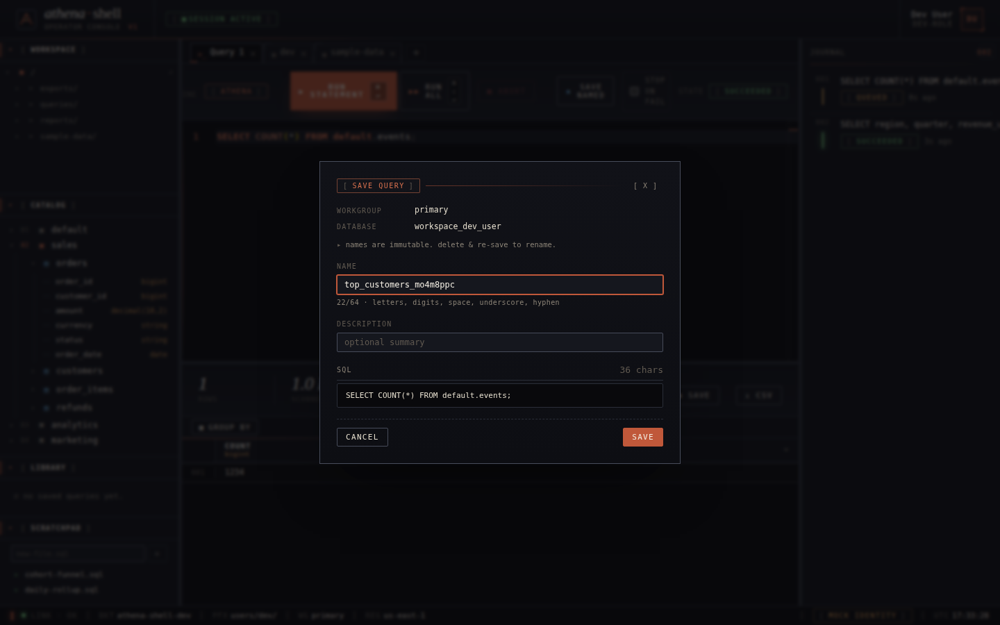

Once saved, the query lives in the left rail and can be re-opened
into a fresh tab with one click.

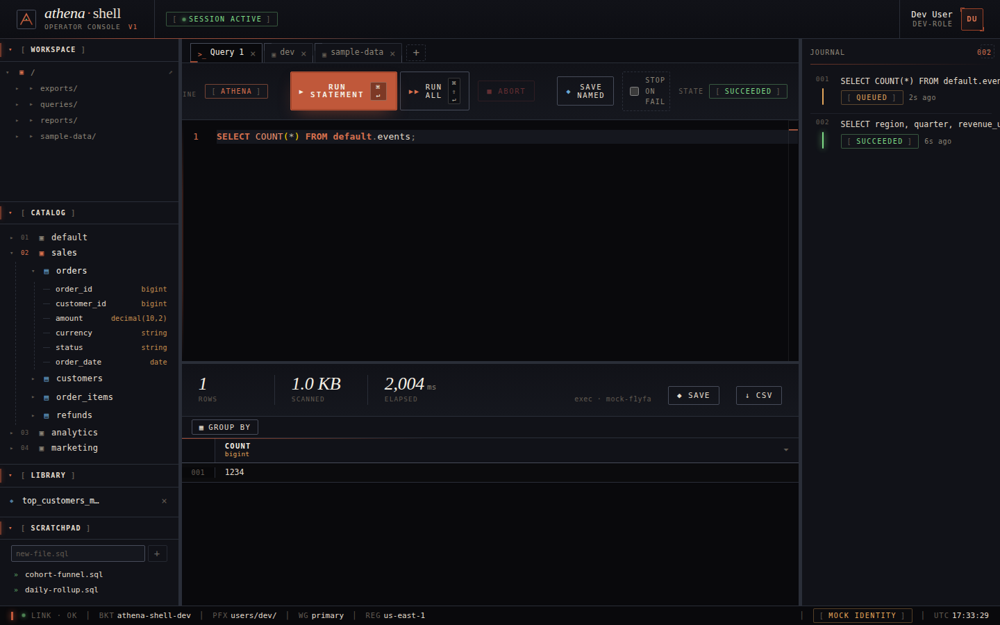

## Scratchpad

Scratchpad files are ordinary `.sql` objects under
`<prefix>/queries/`. The panel lists them with rename / delete
affordances; opening one attaches it as a tab. **Cmd+S** (or the
toolbar save-file button) writes the buffer back to S3 and clears
the dirty marker.


Opened as a tab, a scratchpad file behaves identically to any other
SQL tab — with the added bookkeeping that a dirty buffer tracks
unsaved edits against the S3 etag.

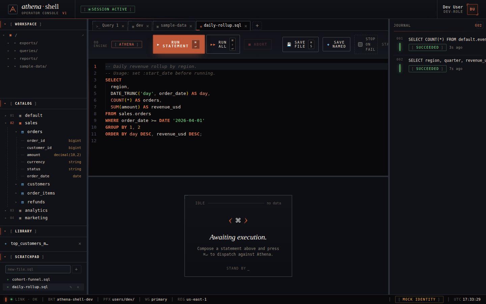

## Tabs

Tabs mix SQL, browser, and scratchpad kinds in a single strip. Each
tab owns its own SQL buffer, selected database, and last execution.
A browser tab's prefix is persisted, so restoring a session returns
you to the directory you were last in.

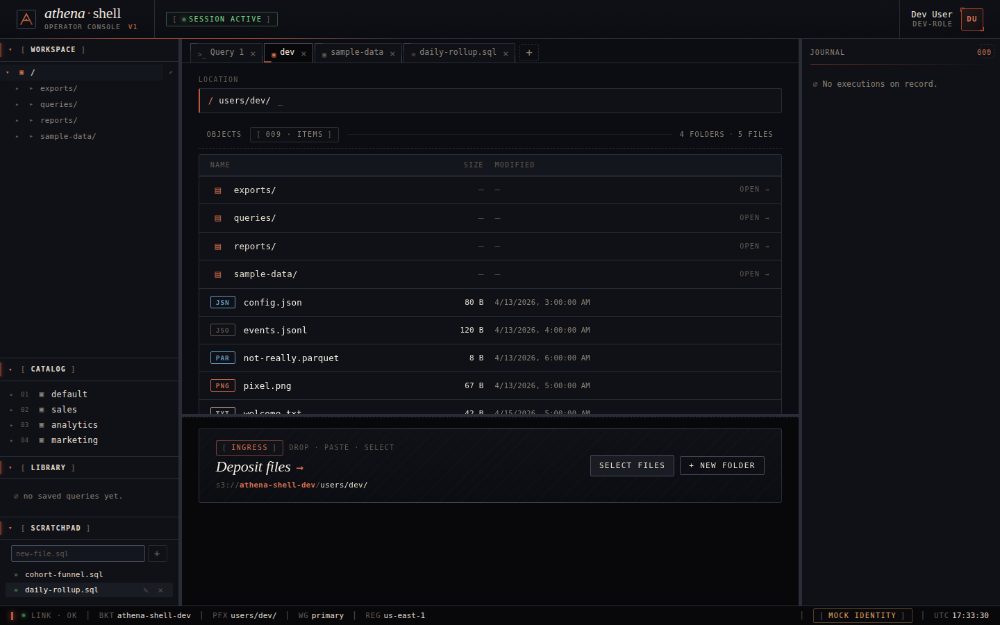

Tab state persists in IndexedDB and re-hydrates on reload; the
active tab is tracked per session.
